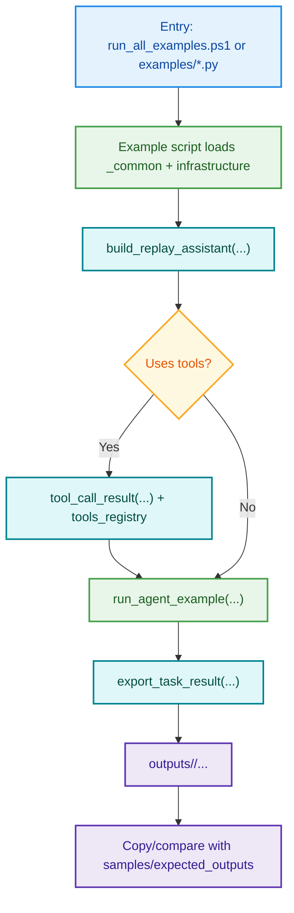

# AutoGen Examples

This repository provides **didactic AutoGen examples** for generic agent exploration workflows.
The code is split into:

- `src/autogen_infrastructure`: reusable infrastructure modules.
- `examples`: runnable scripts that demonstrate patterns progressively.

All tutorials and references are intentionally written in English.

## Project Layout

```text
AutoGen/
  data/
  docs/
  examples/
  outputs/
  samples/expected_outputs/
  scripts/
  src/autogen_infrastructure/
```

## Visual flowchart (GitHub)

GitHub renders Mermaid natively. For the complete flow with legend and branches, see:
`docs/AUTOGEN_CALL_FLOW.md`

For a detailed GitHub lifecycle flow (local changes -> commit -> push -> remote update), see:
`docs/GITHUB_WORKFLOW_FLOW.md`



## Quick Start

From the `AutoGen` folder:

```bash
python -m venv .venv
.\.venv\Scripts\python -m pip install --upgrade pip setuptools wheel
.\.venv\Scripts\python -m pip install -r requirements.txt
.\.venv\Scripts\python -m pip install -e .
```

Run all examples:

```bash
.\scripts\run_all_examples.ps1
```

Run one example individually:

```bash
$env:PYTHONPATH = (Resolve-Path .\src)
.\.venv\Scripts\python.exe .\examples\05_planner_executor.py
```

Regenerate expected outputs:

```bash
.\scripts\regenerate_expected_outputs.ps1
```

## Example Matrix

| Example Script | Demonstrates | Infrastructure Modules Used | Expected Output Folder |
|---|---|---|---|
| `examples/01_basic_agent_chat.py` | Single agent baseline | `agents_factory.py`, `orchestrators.py`, `output_writer.py` | `samples/expected_outputs/01_basic_agent_chat/` |
| `examples/02_tools_file_explorer.py` | Tool-calling for file exploration | `tools_fs.py`, `tools_registry.py`, `model_client.py`, `agents_factory.py`, `orchestrators.py` | `samples/expected_outputs/02_tools_file_explorer/` |
| `examples/03_tools_text_analyzer.py` | Keyword-based text inspection | `tools_text.py`, `tools_registry.py`, `model_client.py`, `agents_factory.py`, `orchestrators.py` | `samples/expected_outputs/03_tools_text_analyzer/` |
| `examples/04_multi_agent_handoff.py` | Planner-to-analyst handoff | `agents_factory.py`, `orchestrators.py`, `output_writer.py` | `samples/expected_outputs/04_multi_agent_handoff/` |
| `examples/05_planner_executor.py` | Planner + executor with tools | `tools_fs.py`, `tools_registry.py`, `model_client.py`, `agents_factory.py`, `orchestrators.py` | `samples/expected_outputs/05_planner_executor/` |
| `examples/06_reflection_loop.py` | Self-critique and revision loop | `agents_factory.py`, `orchestrators.py`, `output_writer.py` | `samples/expected_outputs/06_reflection_loop/` |
| `examples/07_document_explorer.py` | Generic document exploration | `tools_fs.py`, `tools_text.py`, `tools_registry.py`, `model_client.py`, `agents_factory.py`, `orchestrators.py` | `samples/expected_outputs/07_document_explorer/` |
| `examples/08_batch_explorer.py` | Batch pipeline with deterministic summaries | `tools_data.py`, `tools_fs.py`, `tools_registry.py`, `model_client.py`, `agents_factory.py`, `orchestrators.py`, `output_writer.py` | `samples/expected_outputs/08_batch_explorer/` |
| `examples/09_human_in_the_loop.py` | Human approval gate before execution | `tools_fs.py`, `tools_registry.py`, `model_client.py`, `agents_factory.py`, `orchestrators.py` | `samples/expected_outputs/09_human_in_the_loop/` |

## What to Expect in Each Output Folder

Every example writes:

- `run_metadata.json`: run metadata (example id, timestamp, message count, stop reason).
- `input_text.txt`: exact input task sent to the example run.
- `example_output.txt`: final output produced by the example (last message content).
- `transcript.md`: full conversational trace in readable markdown.
- `result.json`: structured message payloads for programmatic inspection.
- `tool_calls.jsonl`: tool call request/execution events (empty for non-tool examples).

### Output Files Reference

| File | Purpose | Typical Use |
|---|---|---|
| `run_metadata.json` | Technical metadata about a run | Auditing, reproducibility checks |
| `input_text.txt` | Input prompt/task used in execution | Understand expected scenario and replay context |
| `example_output.txt` | Final answer produced by the example | Quick “what should I expect” check |
| `transcript.md` | Full step-by-step conversation | Debugging agent flow and reasoning sequence |
| `result.json` | Structured representation of all messages | Automated assertions and downstream processing |
| `tool_calls.jsonl` | Tool call request/execution records | Validate tool usage and arguments |

Some examples also add custom files:

- `expected_behavior.md`
- `expected_summary.json`
- `analysis_expectations.json`
- `handoff_structure.json`
- `plan_expectation.json`
- `reflection_cycles.json`
- `document_index.json`
- `batch_summary.csv`
- `item_results.json`
- `human_decisions.json`

## Why `examples` and `autogen_infrastructure` are separate

- `autogen_infrastructure` centralizes reusable components.
- `examples` stay short and focused on teaching one concept each.
- The separation avoids code duplication and improves maintainability.

## References

- AutoGen official repository: https://github.com/microsoft/autogen
