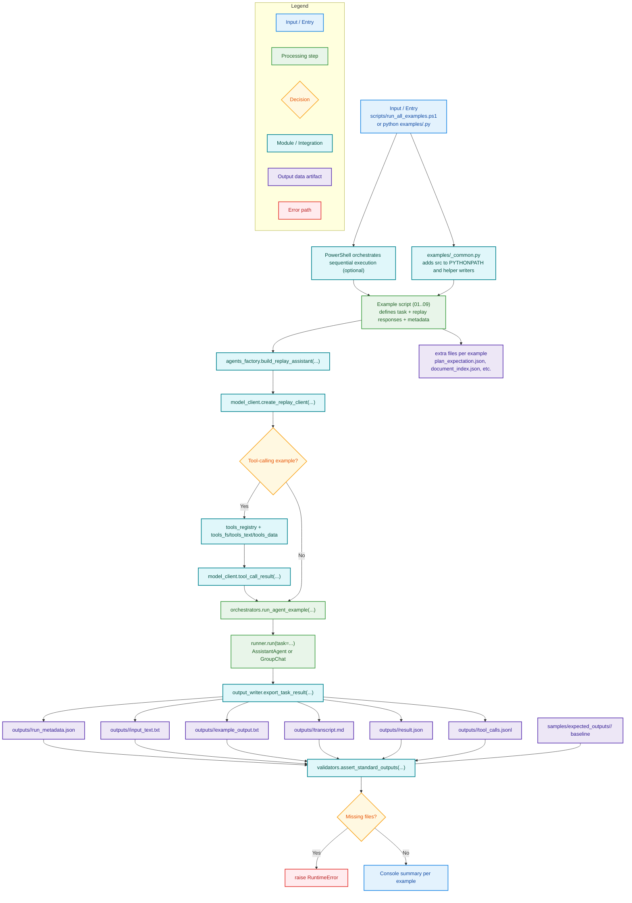

# AutoGen Call Flow

This document explains the runtime chain of `AutoGen` examples and where outputs are produced.

## Mermaid flowchart

## Notes

- Current model mode in this repository is replay/mock (`ReplayChatCompletionClient`).
- Tool-capable examples simulate tool calls with deterministic responses.
- `outputs/` contains the current run; `samples/expected_outputs/` is versioned reference data.
