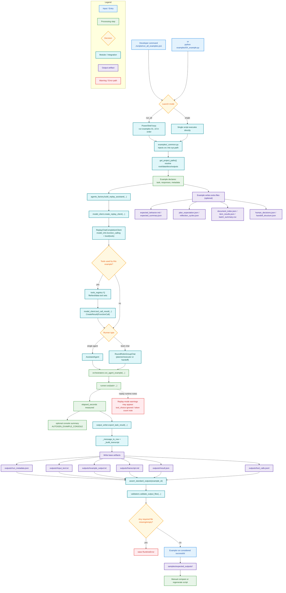

# AutoGen Runtime Call Flow (Detailed)

This diagram shows the full runtime path inside `AutoGen_Examples`, including:
- launch modes (`run_all_examples.ps1` vs single script),
- infrastructure function calls,
- tool-calling/replay behavior,
- output files and validation gates.

For per-example operational detail (what happens in each `01..10`, expected input/output, and AutoGen primitives), see:
`docs/PER_EXAMPLE_EXECUTION_FLOW.md`

## Mermaid flowchart

## Notes

- Current model mode: replay/mock (`ReplayChatCompletionClient`), deterministic for didactic use.
- Tool-calling examples are simulated by replayed `FunctionCall` messages.
- Base outputs are always under `outputs/<example_id>/`.
- Reference outputs remain under `samples/expected_outputs/<example_id>/`.
