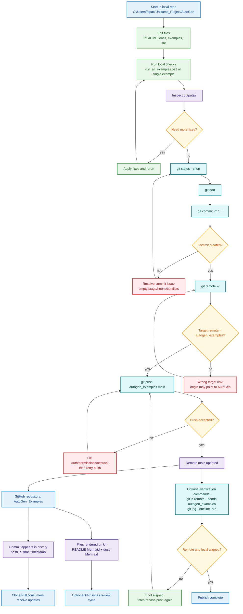

# GitHub Workflow Flow (Detailed)

This flow describes the exact publish path for this workspace when targeting:
`https://github.com/felipephelp/AutoGen_Examples`.

## Repository notes

- This workspace has multiple remotes; use `autogen_examples` when the target is `AutoGen_Examples`.
- Mermaid diagrams render directly in GitHub for both:
  - `docs/AUTOGEN_CALL_FLOW.md`
  - `docs/GITHUB_WORKFLOW_FLOW.md`
- Current repository does not include `.github/workflows/` CI automation.
