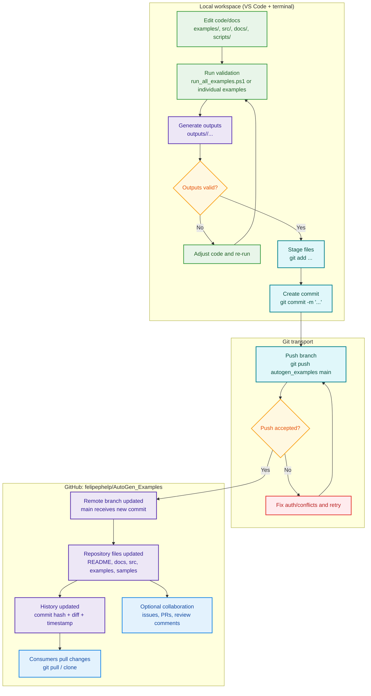

# GitHub Workflow Flow (Detailed)

This flow describes what happens from local development to repository updates in GitHub (`AutoGen_Examples`).

## What this repository currently does on GitHub

- Stores deterministic examples and expected outputs for reproducibility.
- Tracks documentation updates (`README`, `docs/*`) and infrastructure code (`src/*`).
- Does not currently include a `.github/workflows/` CI pipeline in this repository.
